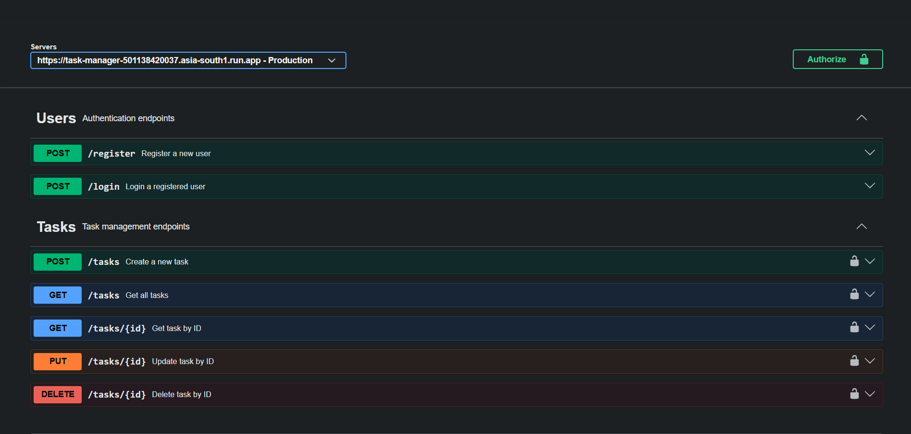
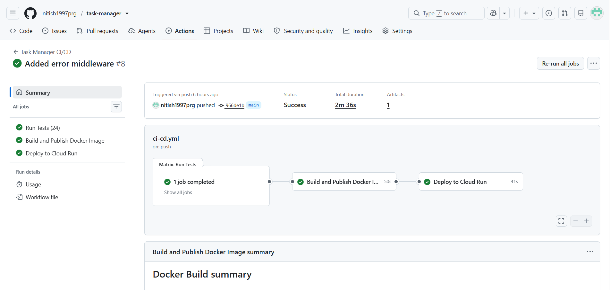
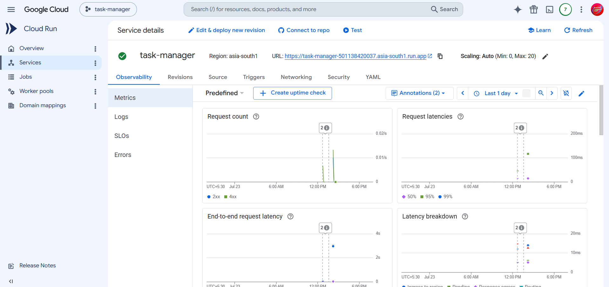

# Task Manager API

A production-ready RESTful Task Manager API built with **Node.js**, **Express 5**, and **MongoDB**. The project demonstrates modern backend development practices including JWT authentication, request validation, automated testing, containerization, CI/CD, cloud deployment, and interactive API documentation.

---

## Features

* User registration and authentication using JWT
* CRUD operations for tasks
* User-specific task isolation
* Request validation using Zod
* Centralized error handling
* RESTful API design
* Interactive API documentation with Swagger/OpenAPI
* Unit testing with Jest
* Integration testing with Supertest and MongoDB Memory Server
* Dockerized application
* Automated CI/CD using GitHub Actions
* Deployed to Google Cloud Run

---

## Tech Stack

| Category           | Technologies                           |
| ------------------ | -------------------------------------- |
| Runtime            | Node.js                                |
| Framework          | Express 5                              |
| Database           | MongoDB Atlas                          |
| ODM                | Mongoose                               |
| Authentication     | JSON Web Tokens (JWT)                  |
| Validation         | Zod                                    |
| Testing            | Jest, Supertest, MongoDB Memory Server |
| Documentation      | Swagger / OpenAPI                      |
| Containerization   | Docker, Docker Compose                 |
| CI/CD              | GitHub Actions                         |
| Container Registry | Google Artifact Registry               |
| Deployment         | Google Cloud Run                       |

---

## API Endpoints

### Authentication

| Method | Endpoint    | Description                           |
| ------ | ----------- | ------------------------------------- |
| POST   | `/register` | Register a new user                   |
| POST   | `/login`    | Authenticate a user and receive a JWT |

### Tasks

| Method | Endpoint      | Description           |
| ------ | ------------- | --------------------- |
| POST   | `/tasks`      | Create a new task     |
| GET    | `/tasks`      | Retrieve all tasks    |
| GET    | `/tasks/{id}` | Retrieve a task by ID |
| PATCH  | `/tasks/{id}` | Update a task         |
| DELETE | `/tasks/{id}` | Delete a task         |

---

## Authentication

Protected endpoints require a JWT in the `Authorization` header.

Example:

```http
Authorization: Bearer <your_jwt_token>
```

---

## API Documentation

Swagger/OpenAPI documentation is available at:

### Local

```
http://localhost:3000/docs
```

### Production

```
https://<your-cloud-run-url>/docs
```

---

## Screenshots

### Swagger UI



### GitHub Actions CI/CD



### Google Cloud Run Deployment



---

## Project Structure

```text
.
├── config/
├── controllers/
├── middlewares/
├── models/
├── routes/
├── validations/
├── tests/
├── app.js
├── server.js
└── package.json
```

---

## Getting Started

### Clone the repository

```bash
git clone https://github.com/nitish1997prg/task-manager.git
cd task-manager
```

### Install dependencies

```bash
npm install
```

### Configure environment variables

Create a `.env` file in the project root.

Example:

```env
PORT=3000

MONGODB_URI=<your_mongodb_connection_string>

JWT_SECRET=<your_secret_key>
```

### Run the application

```bash
npm start
```

or

```bash
npm run dev
```

---

## Docker

Build the Docker image:

```bash
docker build -t task-manager .
```

Run the container:

```bash
docker run -p 3000:3000 task-manager
```

Alternatively:

```bash
docker compose up
```

---

## Running Tests

Run all tests:

```bash
npm test
```

The project includes:

* Unit Tests
* Integration Tests
* MongoDB Memory Server for isolated database testing

---

## CI/CD Pipeline

Every push to the main branch triggers a GitHub Actions workflow that:

1. Installs dependencies
2. Runs the complete test suite
3. Builds the Docker image
4. Pushes the image to Google Artifact Registry
5. Deploys the latest version to Google Cloud Run

---

## Cloud Deployment

The application is deployed on **Google Cloud Run**.

Deployment uses:

* Google Artifact Registry
* Workload Identity Federation (OIDC)
* GitHub Actions
* Automatic deployment on successful builds

---

## Sample Response

```json
{
    "insertedId": "669b76d6c3f3a8b4c5e712a9",
    "message": "Task inserted successfully"
}
```

---

## Future Improvements

* Refresh Tokens
* Rate Limiting
* Email Verification
* Password Reset
* Pagination Metadata
* Request Logging
* Role-Based Access Control (RBAC)

---

## Author

**Nitish Viraktamath**

GitHub: https://github.com/nitish1997prg
